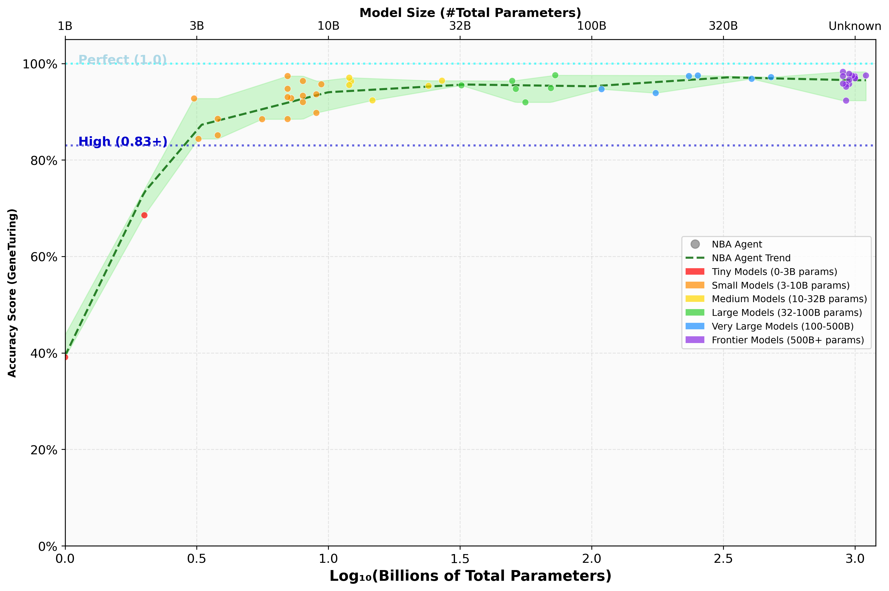
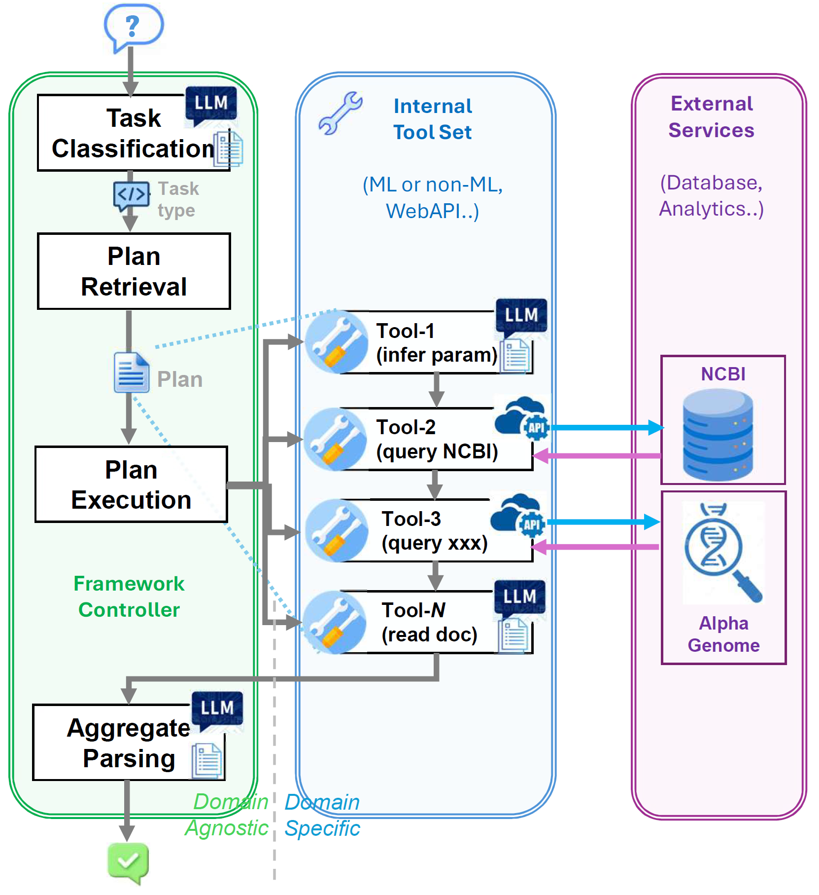

# Nano Bio-Agent (NBA): Small Language Model Agents for Genomics

[](https://www.python.org/downloads/)
[](https://opensource.org/licenses/MIT)

> **Enabling Small Language Models to Excel at Bio-informatics Q&A Through Tool Orchestration**

Nano Bio-Agent (NBA) is a agent-based framework that democratizes genomics AI applications by enabling small language models (SLM) to achieve performance comparable to much larger models through intelligent tool orchestration. Built upon insights from GeneGPT, NBA introduces an agentic architecture that reduces model size requirements significantly while maintaining accuracy and robustness through task decomposition and NCBI API integration.

## 🎯 Key Features

- **🔬 Nano-Scale Intelligence**: Achieve large model performance (e.g. proprietary / commercial models) with SLM, defined practically as sub 10 B parameters (see working definition (WD1) in https://research.nvidia.com/labs/lpr/slm-agents paper).
- **🤖 Agentic Architecture**: Modular, configuration-driven framework using LangChain LCEL.
- **🔄 Multiple Methods for Benchmarks**: NBA vs GeneGPT vs Direct LLM vs Function Call comparison.
- **🌐 Model Agnostic**: Support for testing 47+ models across inference providers (OpenAI, Anthropic, Google, NVIDIA NIM, HuggingFace) and Ollama locally.
- **⚡ Performance Optimized**: API caching, dynamic truncation, and comprehensive monitoring of timing, token usage and error messages.
- **📊 Comprehensive Evaluation**: Built-in benchmarking against GeneTuring dataset with detailed analytics.

## 🚀 Quick Start

### Installation

```bash
# Clone the repository
git clone https://github.com/georgesshong/nanobioagent
cd nanobioagent

# Install dependencies
pip install -r requirements.txt

# Set up environment variables
cp .env.example .env
# Edit .env with your API keys
```

### Basic Usage Examples

```bash
# Run with NBA (NanoBioAgent framework) with 'nba' as experiment name and chosen model 
python main.py nba --method agent --model gpt-4.1-mini

# Use SLM (<10 billion param) model
python main.py nba --method agent --model qwen/qwen2.5-coder-7b-instruct
python main.py nba --method agent --model gemini-1.5-flash-8b
python main.py nba --method agent --model nvidia/nvidia-nemotron-nano-9b-v2

# Use small local models via Ollama (needs local installation)
python main.py nba --method agent --model ollama/qwen2.5-coder-7b-instruct

# Compare with GeneGPT implementation  
python main.py nba --method genegpt --model claude-sonnet-4-20250514
# Compare with Direct LLM prompting implementation  
python main.py nba --method direct --model claude-sonnet-4-20250514
# Compare with pure coded function or retrieval from saved down answer files
python main.py nba --method code
python main.py nba --method retrieval

# Run specific tasks only (0-indexed) from the 9 GeneTuring set
python main.py nba --method agent --task_idx "0,2,4"
```
Other example scripts (.bat) are saved in the top folder for batch experiments.
```bash
# Loop over a list of models and methods, potentially restricting on a subset of all questions
run_main_models_methods.bat 
```

### Quick Start via NBA package

```python
import nanobioagent as nba

# Ask a genomics question with NBA
result = nba.answer(
    question="What is the official gene symbol of LMP10?",
    method="agent",  # NBA
    model_name="qwen/qwen2.5-coder-7b-instruct"  # SLM / LLM
)

print(f"Answer: {result}")  # Output: "PSMB10"
```

## 📈 Performance Results

### Key Highlights

- **Highest Performance**: Open models achieved excellent performance, with the highest reaching **98%** accuracy
- **Small Model Excellence**: Most SLM in the sweet-spot (7-10B) range achieved >90% accuracy
- **7B Parameter Champions**: Qwen 2.5 Coder 7B achieved **97.39%** with only 7B parameters
- **Model Diversity**: Results span 13 different model families and sizes from 1B to 1000B parameters
- **Robustness**: NBA framework maintains high performance across diverse architectures and sizes

📊 [Complete Performance Results (50 models tested)](#appendix-complete-nba-framework-performance-results)

<p align="center">
  
</p>

Plotting scores versus model size, we observe that the NBA agentic approach shows consistently strong performance, from 1 trillion+ all the way down to the 3 billion parameters range. Models in the 7-10B parameter range consistently achieve 88\% to 97\% accuracy and the performance extend across the model size and variety of model families. This suggests that we can, with a decent level of confidence, utilise most models, SLM or LLM, Open or Proprietary, dense or MoE, provided the parameter counts are above the 3 billion mark. The "sweet spot" of 7-10B is particularly noteworthy given it simultaneously achieves accuracy and cost efficiency.

*(Results on GeneTuring benchmark over 9 genomics Q&A question categories)*
<p align="center">
  
</p>

## 🏗️ Architecture Overview

### NBA (NanoBioAgent Framework) 

<p align="center">
  
</p>

**Design Rationale**: The motivation stems from the observation that delegating the entire chain of operations to an LLM through an overarching prompt (as in GeneGPT) places excessive burden on the model's ability to generalize from few-shot examples and follow instructions precisely. By decomposing the process into individual tasks and applying different techniques (LLM reasoning or coded functions) as appropriate, we leverage each component's strengths while ensuring more robust execution.

## 📊 Supported Tasks

We support the following Q&A from the GeneTuring dataset:

| Task Category | Examples | Supported APIs |
|---------------|----------|----------------|
| **Gene Nomenclature** | Gene alias, name conversion | NCBI E-utils |
| **Genomic Location** | Gene/SNP chromosomal location | NCBI E-utils |
| **Functional Analysis** | Gene-disease associations, protein coding | NCBI E-utils |
| **Sequence Alignment** | DNA sequence mapping | NCBI BLAST |

We also experimented with tools calling into [AlphaGenome](https://deepmind.google.com/science/alphagenome/) with the same framework:
| Task Category | Examples | Supported APIs |
|---------------|----------|----------------|
| **ISM Analysis** | ISM analysis to identify critical bases in DNA sequence | AlphaGenome |
| **SNP Splicing** | Analyze SNP splicing impact using NCBI + AlphaGenome integration | NCBI, AlphaGenome |
| **Expression Comparison** | Compare gene expression across multiple tissues | NCBI, AlphaGenome |

## 🔧 Configuration

NBA is fully configuration-driven, enabling rapid iteration without code changes:

```
config/
├── tasks.json              # Task definitions and patterns
├── plans.json              # Execution plan definitions  
├── tools/
│   └── ncbi_tools.json     # NCBI tool configurations
└── examples/
    └── ncbi_examples.json  # Few-shot learning examples
```

Example task configuration:
```json
{
  "gene_location": {
    "description": "Gene Location",
    "patterns": [
      "Which chromosome is gene located on human genome",
      "chromosome location",
      "chromosome located",
      "genome location"
    ],
    "plan": "plan_esearch_esummary",
    "answer_format": {
      "type": "string",
      "pattern": "^chr([1-9]|1[0-9]|2[0-3]|X|Y)$",
      "description": "Chromosome location in format 'chr' followed by number (1-23) or X/Y"
    }
  },...
}
```

**Rationale**: Configuration-driven design allows domain experts to enhance performance without touching framework code, while the sub-task operations can be handled by SLM or other tools.

## 📝 Evaluation & Benchmarking

### Run Evaluation
```bash
# Evaluate single approach
python nanobioagent/evaluation/evaluate.py results/nba/claude-3-5-haiku-20241022_agent

# Compare multiple approaches
python nanobioagent/evaluation/compare.py \
    results/nba/gpt-4o-mini_agent \
    results/nba/gpt-4o-mini_genegpt \
    results/nba/claude-3-5-sonnet_agent
```
One can also run pre-defined .bat scripts to achieve same goals.

### Evaluation Metrics
- **Task-specific accuracy** for each genomics domain, down to question level
- **API call efficiency** and caching effectiveness
- **Token usage** and cost analysis
- **Error categorization** and failure mode analysis, down to individual steps

## 🌐 Supported Models
The existing code supports easy testing of 50+ models by leveraging off the following Inference Providers: 
### Cloud APIs => Inference Providers
- **OpenAI**: GPT model series (gpt-3.5-turbo to gpt-5)
- **Anthropic**: Claude model series (claude-3-5-haiku to claude-opus-4)
- **Google**: Gemini model series (gemini-1.5-flash-8b to gemini-2.5-pro)
- **NVIDIA NIM**: Open models (https://build.nvidia.com/models)
- **Hugging Face**: Open models (https://huggingface.co/models)

### Local Models
- **Ollama**: Locally downloaded models (e.g. Llama3, Meditron, Gemma3, CodeLlama)

**📋 Complete Model List:** See [model_config.json](nanobioagent/config/model_config.json) for all supported models with parameter count and configuration details.

One can extend the list easily by simply adding to the [model_config.json](nanobioagent/config/model_config.json) file.


### 🧪 Implications and Benefits
NBA demonstrates support for the thesis in [SLMs are the Future of Agentic AI](https://arxiv.org/pdf/2506.02153):

#### **V1 - Sufficient Capability** 🎯
SLMs (7-10B parameters) achieve **85-97% accuracy** on GeneTuring genomics tasks, proving specialized reasoning doesn't require massive models when properly orchestrated within an agentic framework.

#### **V2 - Operational Suitability** ⚡
NBA's modular design leverages SLMs' **faster inference**, **reduced memory footprint**, and **enhanced debuggability**. Multiple coordinated model calls within single queries benefit from rapid iteration through task classification, parameter inference, and result parsing.

#### **V3 - Economic Necessity** 💰
**10-30× efficiency gains** in inference costs and energy consumption make genomics AI accessible to resource-constrained research environments that previously couldn't afford large model deployments.

*Genomics serves as a compelling proof-of-concept for SLM-based agentic systems across scientific applications.*

## 📚 Documentation

| Document | Description |
|----------|-------------|
| **[🚀 NBA Paper](docs/paper/NBA.pdf)** | Paper summarising methodology and results |
| **[🛠️ Contributing Guide](docs/CONTRIBUTING.md)** | Development guidelines and extension examples |

## 🤝 Contributing

We welcome contributions! See our [Contributing Guide](docs/CONTRIBUTING.md) for details.

### Quick Contribution Areas
- **New Tasks**: Add support for additional genomics queries
- **Nano Model Optimization**: Improve small model performance
- **Local Model Integration**: Support for new local/edge models
- **Performance Optimization**: Caching and truncation improvements
- **Cost Analysis**: Model efficiency and cost-performance metrics

## 📄 Citation

If you use NanoBioAgent (NBA) in your research, please cite:
**Paper:** [NBA: Nano-Scale Language Model Agents for Bioinformatics](docs/paper/NBA.pdf)
```bibtex

@misc{nbaHong2025,
  title={Nano Bio-Agents (NBA): Small Language Model Agents for Genomics},
  author={George Hong, Daniel Trejo Banos},
  year={2025},
  eprint={XXXX.XXXXX},
  archivePrefix={arXiv},
  primaryClass={cs.AI}
}
```


## Appendix: Complete NBA Framework Performance Results

### Table: NBA Framework Results by Family across 48 tested models
*Loosely ordered by Total parameter count (activated or not) or estimates, within family.*

<sub>

| **Family** | **Model** | **Score** | **Size (B)** |
|------------|-----------|-----------|--------------|
| | | | |
| **Claude** | claude-sonnet-4-20250514 | 97.85% | ?? |
| Claude | claude-3-7-sonnet-20250219 | 95.69% | ?? |
| Claude | claude-3-5-haiku-20241022 | **98.26%** | ?? |
| | | | |
| **GPT** | gpt-4.1 | 97.39% | ?? |
| GPT | gpt-4.1-mini | 96.60% | ?? |
| GPT | gpt-4.1-nano | 92.31% | ?? |
| GPT | gpt-5-nano | 95.18% | ?? |
| GPT | gpt-4o-mini | 95.82% | ?? |
| GPT | gpt-3.5-turbo | 93.88% | 175.0 |
| | | | |
| **Gemini** | gemini-2.5-flash-lite | 97.46% | ?? |
| Gemini | gemini-2.0-flash | 95.75% | ?? |
| Gemini | gemini-1.5-flash | 97.39% | ?? |
| Gemini | gemini-1.5-flash-8b | 96.37% | 8.0 |
| | | | |
| **Gemma** | google/gemma-3-27b-it | 96.43% | 27.0 |
| Gemma | google/gemma-3-12b-it | 96.32% | 12.2 |
| Gemma | google/gemma-2-9b-it | 89.76% | 9.0 |
| Gemma | google/gemma-2-2b-it | 68.54% | 2.0 |
| Gemma | google/gemma-3-1b-it | 39.12% | 1.0 |
| | | | |
| **Llama** | meta/llama-3.1-405b-instruct | 96.83% | 405.0 |
| Llama | meta/llama-4-scout-17b-16e-instruct | 94.68% | 109.0 |
| Llama | meta/llama-3.3-70b-instruct | 94.90% | 70.0 |
| Llama | meta/llama-3.1-8b-instruct | 93.31% | 8.0 |
| Llama | meta/llama-3.2-3b-instruct | 84.38% | 3.2 |
| | | | |
| **Mistral** | mistralai/mixtral-8x7b-instruct-v0.1 | 91.96% | 56.0 |
| Mistral | mistralai/mistral-small-3.1-24b-instruct-2503 | 95.36% | 24.0 |
| Mistral | mistralai/mistral-nemotron | 97.05% | 12.0 |
| Mistral | mistralai/mistral-7b-instruct-v0.3 | 93.03% | 7.0 |
| | | | |
| **Nemotron** | nvidia/llama-3.1-nemotron-ultra-253b-v1 | 97.51% | 253.0 |
| Nemotron | nvidia/llama-3.1-nemotron-51b-instruct | 94.73% | 51.5 |
| Nemotron | nvidia/llama-3.3-nemotron-super-49b-v1.5 | 96.38% | 49.9 |
| Nemotron | nv-mistralai/mistral-nemo-12b-instruct | 95.53% | 12.0 |
| Nemotron | nvidia/nvidia-nemotron-nano-9b-v2 | 93.61% | 9.0 |
| | | | |
| **Phi** | microsoft/phi-4 | 92.36% | 14.7 |
| Phi | microsoft/phi-3-small-128k-instruct | 88.48% | 7.0 |
| Phi | microsoft/phi-4-multimodal-instruct | 88.46% | 5.6 |
| Phi | microsoft/phi-4-mini-instruct | 88.53% | 3.8 |
| Phi | microsoft/phi-3.5-mini-instruct | 85.12% | 3.8 |
| | | | |
| **Qwen** | qwen/qwen3-coder-480b-a35b-instruct | 97.17% | 480.0 |
| Qwen | qwen/qwen3-235b-a22b | 97.39% | 234.0 |
| Qwen | qwen/qwen2.5-72B-Instruct | 97.56% | 72.7 |
| Qwen | qwen/qwen2.5-coder-32b-instruct | 95.48% | 32.0 |
| Qwen | qwen/qwen2.5-coder-7b-instruct | **97.39%** | 7.0 |
| Qwen | qwen/qwen2.5-7b-instruct | 94.76% | 7.0 |
| Qwen | qwen/qwen2.5-coder-3B-Instruct | 92.74% | 3.1 |
| | | | |
| **Kimi** | moonshotai/Kimi-K2-Instruct-0905 | 96.94% | 1000.0 |
| **GLM** | zai-org/glm-4-9b-0414 | 95.69% | 9.4 |
| **Granite** | ibm/granite-3.3-8b-instruct | 91.99% | 8.0 |
| **Falcon3** | tiiuae/falcon3-7b-instruct | 92.81% | 7.2 |

</sub>

## 🔗 Related Work

- **[GeneGPT Original](https://github.com/ncbi/GeneGPT)**: Foundation work for LLM-genomics integration
- **[GeneTuring Benchmark](https://github.com/Winnie09/GeneTuring)**: Genomics question answering dataset
- **[NCBI E-utilities](https://www.ncbi.nlm.nih.gov/books/NBK25497/)**: NCBI API documentation
- **[LangChain](https://github.com/langchain-ai/langchain)**: Framework for LLM applications

## 📞 Support

- **Issues**: [GitHub Issues](https://github.com/georgesshong/nanobioagent/issues)
- **Discussions**: [GitHub Discussions](https://github.com/georgesshong/nanobioagent/discussions)
- **Email**: [gehong@ethz.ch](mailto:gehong@ethz.ch)

## 📜 License

This project is licensed under the MIT License - see the [LICENSE](LICENSE) file for details.

## 🙏 Acknowledgments

- **Daniel Trejo Banos**: For the ideas and advice supporting the research
- **GeneGPT Team**: For the foundational work that inspired NBA and their open-sourced code
- **GeneTuring Team**: For providing the benchmark dataset for the community
- **NCBI**: For providing comprehensive genomics APIs
- **LangChain Community**: For the excellent framework enabling Agentic AI
- **Open Source Contributors**: For model implementations and tools

---

<div align="center">

**[⭐ Star this repo](https://github.com/georgesshong/nanobioagent)** if you find NBA useful!

</div>